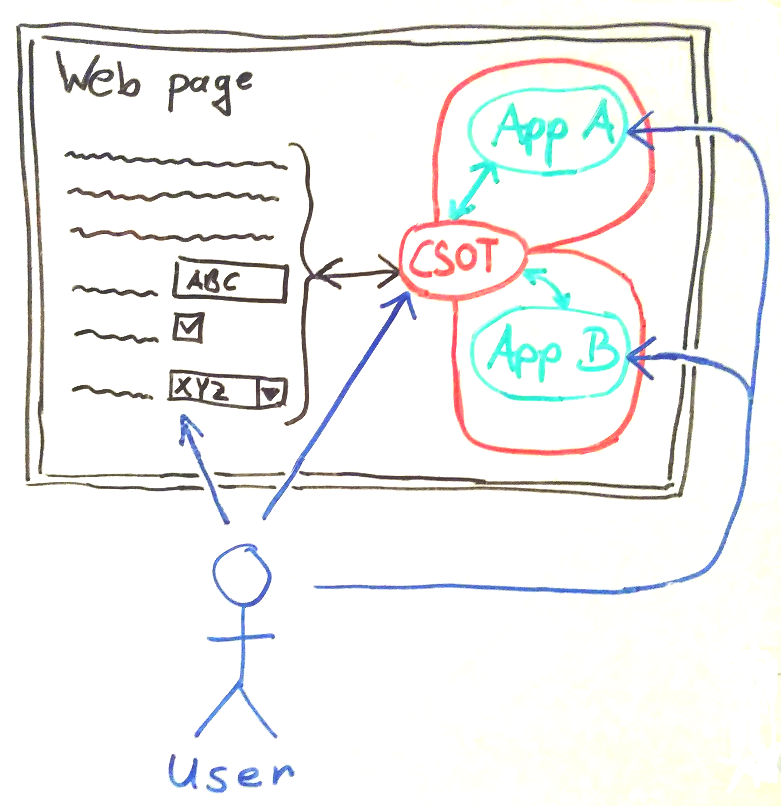

This project is trying to evolve the idea of a __multi-app page (MAP)__, a concept where the user has control over what applications to use on a web page and what data to share.

It conveys the opinionated view of the author(s). As a work in progress it can undergo changes at any time. The changes are reflected transparently by the backing GitHub repository [alaarmann/multi-app-page](https://github.com/alaarmann/multi-app-page/).

## Challenge

When a user loads a web page in her browser, it is quite common that the page, which can be a JavaScript application itself, in turn loads further JavaScript applications from other origins. If these applications are somewhat independent from the page and have a value of their own (e.g. a chat client), we could call that web page a _multi-app page_.

We see the following shortcomings here:
- The owner of the web page decides what applications her page offers to the user. She may leave a choice to the user, but only out of a pre-restricted set.
- If no additional measures are taken, all applications and their owners have full access to the web page's data (e.g. URI, cookies, content). It is common case that the web page contains also the users private data, that is hence put at stake without her knowledge.

For us this poses the challenge to create an intermediate entity that enables the user to add whatever application she wants to the page and that lets her transparently control whether this application should be given access to the page's data and to what extent.

In what follows we call that intermediate entity a __common source of trust (CSOT)__.

## Vision

We advocate the concept of a __multi-app page (MAP)__ enabled by a __common source of trust (CSOT)__ as follows:

A user working with a CSOT-enabled MAP has the option to add one or more applications of her free choice to the page and control their access to the page's data.

By default, the CSOT isolates such an application completely from the page, and the application has no access to anything outside itself. This is already sufficient for self-contained applications that function fully independently. The user wants to have the application on the page for faster access or immediate notification while she is using the page.

The great potential however lies in the interaction between the application and the page. To that end the user can explicitly set permissions for the applications in the CSOT to allow access to the page's data and/or pass the application's own data to the page. That opens up the page for value-added functions to the benefit of the user. Such functions are able to enrich the page in ways not even foreseen by the page owner.

The user is given by the CSOT full transparency over the extent of interaction between application and page and can revoke her permission to interact at any time or even disable in the CSOT the use of the application completely.

The page owner for her part is given by the CSOT a guarantee that the application will not have a negative impact on her page by e.g. breaking functionality or corrupting content. The CSOT restricts the application's access to the page in such a way that only actions are permitted that the user could perform herself in the browser: e.g. reading content, filling out forms, triggering some page-action with a button.

Moreover the app owner and the user are assured that the page can't access the app's data without explicit permission.

### Illustrating examples

#### Self-contained application
We imagine a user adding a chat client as a _self-contained application_ to the web page that contains an application she is usually working with. By default all interaction between the chat client and the page is disallowed. While working with the web page, the user is also able to communicate over the chat client at hands. Doing so she is sure that the web page can't eavesdrop on her communication.

#### Interacting application
We imagine a user adding a speech controller as an _interacting application_ to her favourite page. The user grants the speech controller permission to read the page's displayed data aloud and control the page by transforming the user's spoken commands into clicks on the page.

## Implementation

Central part is the CSOT, which is an HTML-plugin on the web page. The user is able to interact with the CSOT: she opens its user interface by clicking on a button somewhere at the margin of the display area. In the user interface she can add/remove applications, set the permissions for interaction and define the display area for the applications.

__The CSOT as the centrepiece of a MAP__

The user is interacting directly with web page and the added applications. Web page and applications on their turn are able to interact by means of the CSOT.

### Isolation
The CSOT isolates web page and applications by use of the [HTML `iframe` element](https://developer.mozilla.org/en-US/docs/Web/HTML/Element/iframe) and possibly also [HTML Imports](https://developer.mozilla.org/en-US/docs/Web/Web_Components/HTML_Imports).

### Interaction
The CSOT controls the interaction between an application and the web page according to the permissions granted by the user. The CSOT therefore accesses the DOM of the page and/or the application, communication is facilitated by [Window.postMessage()](https://developer.mozilla.org/en-US/docs/Web/API/Window/postMessage).

### Trust

The user trusts in the web page directly based on the TLS-secured URL which the browser displays in the Location Bar.

The web page trusts in the CSOT based on the TLS-secured URL that is part of the CSOT HTML-plugin.

The application trusts in the CSOT and grants the [CORS](https://developer.mozilla.org/en-US/docs/Web/HTTP/CORS) permission to the CSOT's URL.

Currently it is however open, how the user's trust in the CSOT can be established: 'transitive' trust (user trusts in web page, web page trusts in CSOT) is not sufficient.

## Bigger Picture

Up to now we see cross-application interaction in the frontend only poorly supported. The common way to exchange data between user-facing applications is to _copy_ it to the _clipboard_ and _paste_ it in the destination, which results in a user experience that we think should be improved.

On the other hand we see the browser on its way to become the standard runtime environment on the frontend: the rise of [SPA](https://en.wikipedia.org/wiki/Single-page_application), advent of [WebAssembly](https://developer.mozilla.org/en-US/docs/WebAssembly) lead to always 'heavier' browser based applications. In HTML however there is a better chance for a deeper interaction with the data based on e.g. [semantic markup](https://en.wikipedia.org/wiki/Semantic_HTML) or [microformats](https://developer.mozilla.org/en-US/docs/Web/HTML/microformats).

The concept of a MAP is aiming at bringing deeper cross-application interaction to the user and helping to expand the browsers capabilities towards a desktop-like functionality.   

Moreover the MAP wants to move the linking between systems from the backend to the frontend and give the user more control over inter-connections between systems: never trust the server(s).

## Comparison to related concepts
- [Microfrontends](https://micro-frontends.org/): similarity: the inter-component communication over the DOM, difference: all components (micro-apps) belong to the same owner.
- Workflow-services (e.g. [Zapier](https://zapier.com/), [IFTT](https://ifttt.com/)): similarity: cross-application interaction, difference: backend-based

## Open issues
- What would bring a page owner to put the CSOT-plugin on her page? Alternatively the plugin could be inserted on the client side (e.g. browser-plugin, injection by proxy).
- How can the user's trust in the CSOT be established? The CSOT could be a fake one, manipulated by a malicious page owner: how would the user be able to notice?
- How could a supply of includable applications be created?
- How could the interaction between page and application be abstracted, so that arbitrary combinations of page / application become possible?

## Maintainer
This site is maintained by [@alaarmann](https://twitter.com/alaarmann) and hosted on GitHub Pages. The backing repository can be found at [alaarmann/multi-app-page](https://github.com/alaarmann/multi-app-page/).
